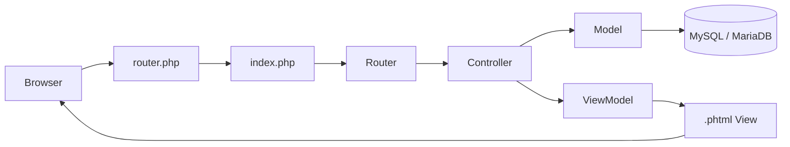

<div align="center">

# Exam Round

### Full-Stack Quiz & Testing Platform

A server-rendered examination management system built from scratch with **PHP 8+**, **MySQL/MariaDB**, **PDO**, **Bootstrap**, and a custom **MVC architecture**.


</div>

---

## About the project

**Exam Round** is a role-based online testing platform for teachers and students. Teachers can manage courses, build a reusable question bank, create scheduled exams, assign questions and marks, and inspect student results. Students can access their courses, take exams within the allowed time window, move between exam pages without losing saved answers, submit their attempt, and receive a calculated score.

The project deliberately avoids a full-stack PHP framework. Routing, controllers, models, database access, view rendering, session handling, and the exam workflow are implemented directly in the repository.

> [!NOTE]
> Although many application URLs start with `/api/`, this is primarily a **server-rendered PHP application**, not a JSON-only REST API. Controllers frequently render `.phtml` views or redirect the browser to another application page.

## Features

### Teacher workflow

* Create, edit, and manage courses.
* Build a course-level question bank.
* Create **multiple-choice** and **true/false** questions.
* Reuse course questions when building exams.
* Create and edit exams with a title, start time, end time, total mark, and status.
* Assign marks to individual exam questions.
* Optionally randomize question order for an exam.
* View exam details, attempts, marks, and course/student performance data.

### Student workflow

* Sign up and log in with a student account.
* Access enrolled courses and scheduled exams.
* Start an exam during its available period.
* Answer questions over multiple pages.
* Save progress while moving between pages.
* Return to previously saved answers during an active attempt.
* Submit an exam once finished.
* View exam/result details after submission.

### Exam engine

The exam-taking flow contains more than a basic form submission:

* Each student/exam pair has a single attempt record.
* Answers are validated against the questions and choices belonging to that exam.
* Progress can be persisted before the final submission.
* Randomized exams use a stable order for the same attempt instead of reshuffling on every page load.
* Once the exam reaches its end time, the attempt can be forced into submission.
* Final marks are calculated from the points earned on correct answers relative to the available question points and the exam's configured total mark.
* Submitted attempts are treated as final rather than being recalculated on every request.

## Tech stack

| Layer                 | Technology                                        |
| --------------------- | ------------------------------------------------- |
| Backend               | Vanilla PHP 8+                                    |
| Architecture          | Custom MVC-style routing/controllers/models/views |
| Database              | MySQL / MariaDB                                   |
| Database access       | PDO with prepared statements                      |
| Templates             | PHP `.phtml` server-rendered views                |
| UI                    | Bootstrap 5.3 + custom CSS                        |
| Client-side behavior  | Vanilla JavaScript                                |
| Sessions              | Native PHP sessions                               |
| Dependency management | Composer                                          |
| Environment variables | `vlucas/phpdotenv`                                |
| Icons / typography    | Font Awesome + Google Fonts                       |

## Application architecture



A typical request follows this path:

1. `router.php` lets PHP's built-in web server serve real static files and forwards other requests to `index.php`.
2. `index.php` starts the session, loads Composer, reads environment variables, applies middleware, registers routes, and dispatches the request.
3. The custom router selects a controller action.
4. Controllers coordinate authentication, validation, models, redirects, and view data.
5. Models use the shared PDO database connection to read and update application data.
6. `ViewModel` renders the appropriate `.phtml` page inside the application layout.

## Data model

The database is centered around these relationships:

```mermaid
flowchart TD
    U[users] --> TC[teacher_courses]
    U --> EN[enrolment]
    U --> AT[attempts]
    C[courses] --> TC
    C --> EN
    C --> Q[questions]
    C --> EX[exams]
    EX --> EQ[exam_questions]
    Q --> EQ
    Q --> CH[choices]
    EX --> AT
    AT --> SA[student_answers]
    Q --> SA
    CH --> SA
    EX --> M[marks]
    U --> M
```



Important database rules include unique student enrolments per course, one attempt per student per exam, unique question assignments within an exam, and one saved answer per student/exam/question combination.

## Project structure

```text
Exam-Round-Full-Stack/
├── backend/
│   ├── config/
│   │   └── database.php
│   ├── controllers/       # Request handling and application workflows
│   ├── models/            # Database/domain operations
│   ├── routes/            # Custom router and route definitions
│   ├── utils/
│   │   ├── Database.php   # Shared PDO connection
│   │   ├── ViewModel.php  # View rendering
│   │   ├── Cors.php
│   │   ├── css/
│   │   └── js/
│   ├── views/             # Server-rendered .phtml pages
│   ├── index.php          # Application bootstrap
│   ├── router.php         # PHP development-server entry point
│   └── composer.json
├── tests/                 # Exam-taking and regression test scripts
├── old DB/                # Legacy database material
├── itc.sql                # Current database dump/schema
├── project.md             # Original project brief
└── README.md
```

## Getting started

### Requirements

Make sure you have:

* PHP 8 or newer
* Composer
* MySQL or MariaDB
* PHP PDO MySQL extension (`pdo_mysql`)
* A modern web browser

### 1. Clone the repository

```bash
git clone https://github.com/YounisAlSayed/Exam-Round-Full-Stack.git
cd Exam-Round-Full-Stack
```

### 2. Create and import the database

The repository includes the current SQL dump in [`itc.sql`](itc.sql).

Using the MySQL/MariaDB CLI:

```bash
mysql -u root -p -e "CREATE DATABASE itc CHARACTER SET utf8mb4 COLLATE utf8mb4_general_ci;"
mysql -u root -p itc < itc.sql
```

You can also create a database named `itc` in phpMyAdmin and import `itc.sql` there.

### 3. Configure environment variables

Inside `backend/`, create a `.env` file for your local database connection:

```dotenv
DB_HOST=127.0.0.1
DB_NAME=itc
DB_USER=root
DB_PASSWORD=your_database_password
```

> [!IMPORTANT]
> Keep real credentials out of version control. A good repository setup is to ignore `.env` and commit a safe `.env.example` containing only placeholder values.

### 4. Install PHP dependencies

```bash
cd backend
composer install
```

The application currently keeps its Composer dependency footprint small; `phpdotenv` is used to load the database environment configuration.

### 5. Start the development server

From the `backend/` directory:

```bash
php -S localhost:8000 router.php
```

Then open one of the application entry pages:

* `http://localhost:8000/api/login`
* `http://localhost:8000/api/signup`

After authentication, the application redirects users into the appropriate dashboard and role-specific workflow.

## Main route groups

The custom router organizes application functionality under these areas:

| Area            | Examples of responsibility                                    |
| --------------- | ------------------------------------------------------------- |
| Users           | Login, signup, profile, editing and account management        |
| Courses         | Course creation, course details, students and teachers        |
| Enrolment       | Student/course relationships                                  |
| Questions       | Question creation, editing, deletion and question bank        |
| Choices         | Answer-choice management                                      |
| Exams           | Creation, editing, preview, scheduling, taking and submission |
| Attempts        | Student exam attempts                                         |
| Student answers | Saved and selected answers                                    |
| Marks           | Exam marks and course/student averages                        |
| Teacher courses | Teacher/course assignments                                    |
| Pages           | Dashboard, login, signup and role-specific rendered views     |

For the exact route definitions, see [`backend/routes/api.php`](backend/routes/api.php).

## Authentication and validation

Authentication is session-based. Passwords are stored using PHP's password hashing functions and checked during login with `password_verify()`.

The application also performs server-side validation around important operations such as:

* teacher-only exam and question management;
* valid exam date ranges and total marks;
* supported user roles;
* valid email addresses and unique accounts;
* valid answer choices for the submitted exam question;
* database writes performed through PDO prepared statements.

## Tests

The [`tests/`](tests/) directory contains custom regression coverage for important exam behavior, including:

* the exam-taking flow;
* question copy/edit behavior;
* rendered exam-taking pages; and
* a browser-oriented exam-taking test covering navigation, saved answers, submission, timing, responsive/mobile behavior, and overflow checks.

The browser test uses Playwright-style browser automation and therefore requires the corresponding Node/browser dependencies when run locally.

## Exam lifecycle at a glance

```text
Teacher creates course
        ↓
Teacher creates / reuses questions
        ↓
Teacher creates exam and assigns questions
        ↓
Exam becomes ready for its scheduled window
        ↓
Student starts an attempt
        ↓
Answers are saved while navigating pages
        ↓
Student submits (or time expires)
        ↓
Attempt is finalized and graded
        ↓
Results / marks can be reviewed
```

## Design goals

This project demonstrates how the major pieces of a web application fit together without relying on a large backend framework: routing, MVC separation, PDO persistence, relational database design, authentication, server-rendered views, client-side interactions, exam state, validation, and grading logic are all visible in the codebase.

For the original assignment requirements and design brief, see [`project.md`](project.md).

---

<div align="center">

**Built as a full-stack PHP examination platform with a custom MVC architecture.**

</div>
